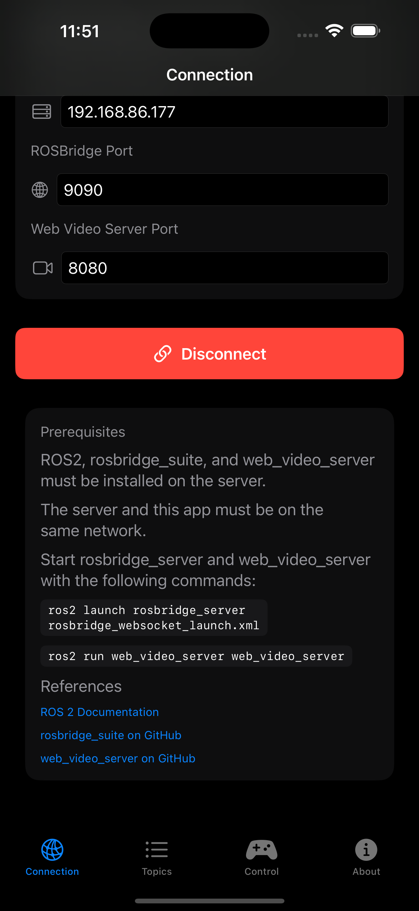
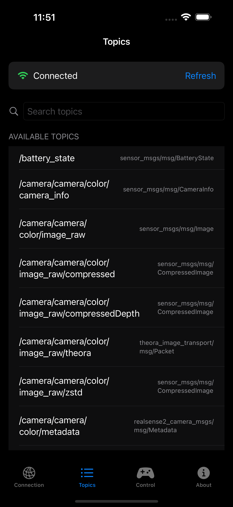
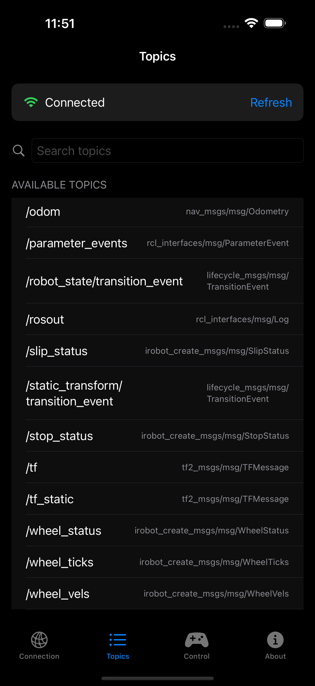
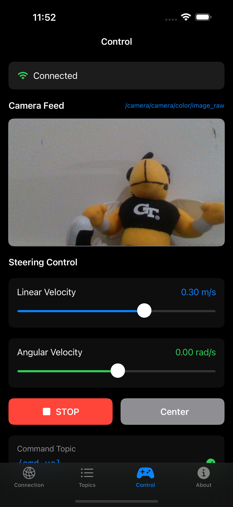
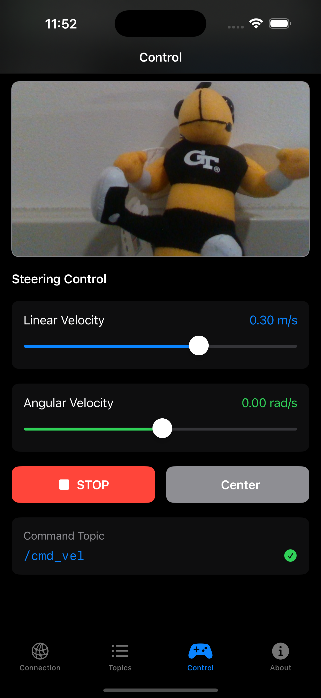
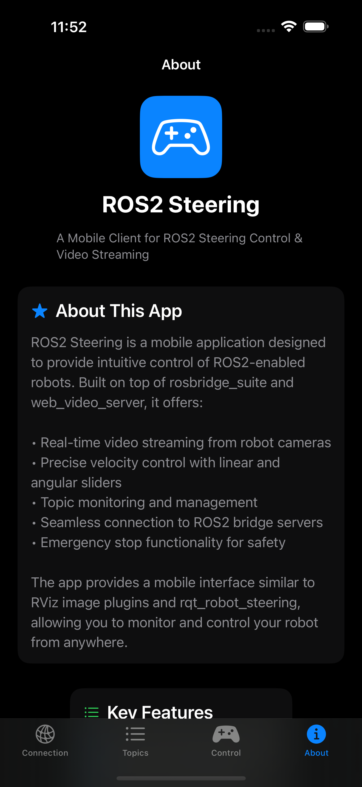
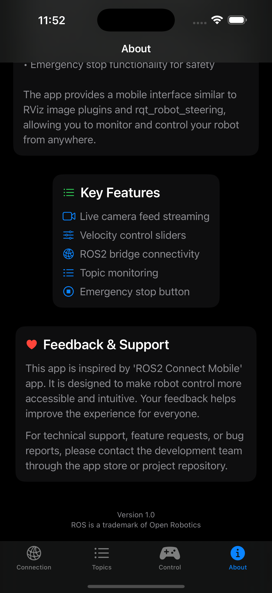

# Introduce iOS App - ROS2 Steering

A mobile client for real-time control and monitoring of ROS 2 robots. Connect over your local network, view live camera feeds, publish `cmd_vel`, browse topics, and hit an emergency stop when you need it.

---

## At a glance

* **Real-time video streaming** from robot cameras
* **Precise velocity control** with linear & angular sliders
* **Topic monitoring** (search, type info, refresh)
* **Emergency stop** button
* **Easy ROS 2 bridge connectivity** (IP/hostname + ports)

---

## Requirements

* ROS 2 installed on your robot or server
* [`rosbridge_suite`](https://github.com/RobotWebTools/rosbridge_suite) running (WebSocket)
* [`web_video_server`](https://github.com/RobotWebTools/web_video_server) running (MJPEG HTTP)
* Your iPhone and the ROS 2 machine on the **same network**

> **Tested with:** iRobot Create3 + iPhone 15

---

## Quick start

1. **Start the bridge and video server** on your ROS 2 machine:

   ```bash
   # WebSocket bridge (default port 9090)
   ros2 launch rosbridge_server rosbridge_websocket_launch.xml

   # MJPEG video server (default port 8080)
   ros2 run web_video_server web_video_server
   ```
2. **Open the app → Connection tab**
   Enter your ROS 2 machine’s IP/hostname, `ROSBridge Port` (e.g., 9090), and `Web Video Server Port` (e.g., 8080). Tap **Connect**.
3. **Use the Topics tab** to browse available topics and confirm your robot is publishing.
4. **Switch to Control** to see the camera feed and send velocity commands on your selected `cmd_vel` topic.

---

## How it works

* The app uses **rosbridge WebSocket** for ROS 2 messages and **web\_video\_server** for MJPEG camera streaming.
* All communication happens **directly** between your iPhone and your ROS 2 host on your network—no cloud relay.

---

## Screenshots

> Place these images in the same folder as this page (or update the paths to where you host them).

### Connection




### Topics




### Control




### About




---

## Troubleshooting

* **Can’t connect?**

  * Verify the ROS 2 host IP is reachable from your iPhone (same Wi-Fi/VLAN).
  * Confirm `rosbridge_server` is running and listening on the specified port (default **9090**).
  * Confirm `web_video_server` is running on the specified port (default **8080**).
  * Check firewalls on the ROS 2 host/router for open **TCP 9090** and **TCP 8080**.
* **No camera image?**

  * Make sure your camera node is publishing (e.g., `/camera/color/image_raw`).
  * Ensure the topic name matches what the app is set to read.
  * If bandwidth is tight, try a compressed topic or lower resolution on the robot side.
* **No motion?**

  * Confirm the **Command Topic** matches your robot’s velocity subscriber (commonly `/cmd_vel`).
  * Verify message type is `geometry_msgs/msg/Twist`.
  * Check that the robot is not in E-Stop or a disabled state.

---

## Privacy

* No accounts, no sign-in.
* The app does **not** send your robot data to external servers.
* Data flows only between your iPhone and the ROS 2 machine you configure on your network.

---

## Feedback & Support

I’ve fully tested the app with **iRobot Create3** and **iPhone 15**. If you run into issues, have feature requests, or spot a bug, please leave feedback via the **App Store** listing’s **App Support** link. Your input helps improve the app for everyone.

---

## References

* [ROS 2 Documentation](https://docs.ros.org/)
* [rosbridge\_suite on GitHub](https://github.com/RobotWebTools/rosbridge_suite)
* [web\_video\_server on GitHub](https://github.com/RobotWebTools/web_video_server)
